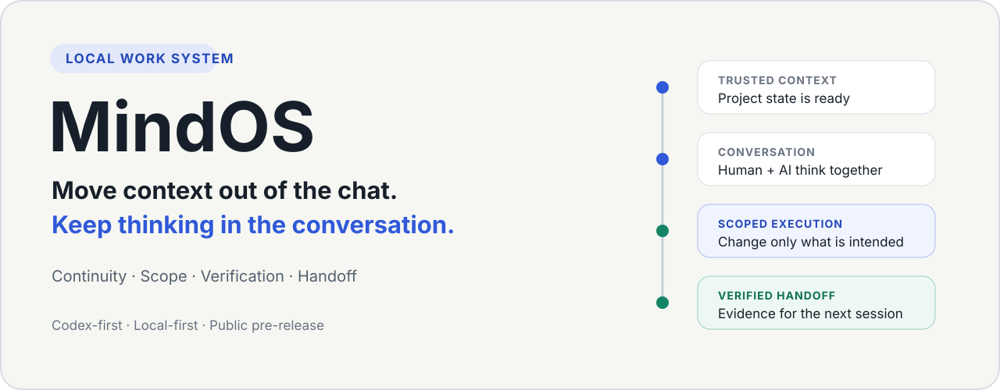
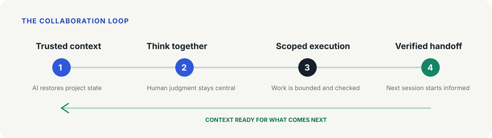

  

# MindOS

**Move context out of the chat. Keep thinking in the conversation.**

MindOS is a **Codex-first local work system for long-running AI projects**. It keeps trusted project context in files, so human and AI can spend the conversation on judgment, ideas, and the work itself—not repeated setup.

**PUBLIC PRE-RELEASE TEST · MIT LICENSED · NOT v0.1 FINAL · EXTERNAL FIRST-USE TESTING**

[Install with AI](#install-with-ai--让-ai-帮你安装) · [See how it works](#how-it-works) · [Start here](START_HERE.md)

New chats lose context. Decisions get buried, and "done" can mean anything from a draft to a verified change. MindOS gives your AI a lightweight way to resume work, stay within scope, check results, and leave a clear handoff.

## Install with AI / 让 AI 帮你安装

Give this repository URL to your AI and say:

> 帮我安装 MindOS，并告诉我安装完成后怎么开始使用。

> Help me install MindOS, then tell me how to start using it.

**AI: read [START_HERE.md](START_HERE.md) first.** It guides environment checks, a safe project-local Skill/protocol installation, actual verification and the next user action. Users do not need to learn Skill paths or workflow terminology first.

It is not an autonomous operating system, background worker, hosted service, or a promise about any model's capabilities.

This is an MIT-licensed public pre-release, not a final v0.1 release, stable product or production-readiness claim. External Human First-use = NOT RUN. Local Skill discovery is verified, not end-to-end onboarding.

Licensed under the MIT License. See [LICENSE](LICENSE).

## How it works

AI restores trusted project context → human and AI think together → work becomes a scoped task → execution is verified → the next session starts informed.

## A 30-second example

Before: new chat → re-explain the project → lose decisions → repeat checks.

With MindOS: “接管这个项目” → AI reads trusted project context → scoped task → verification → one report and handoff.

This illustrates the workflow, not a measured speed or success guarantee.

## Start small

For someone who already uses Codex with an existing local project:

1. Read the [short quick start](docs/QUICK_START.md).
2. Follow the concrete PowerShell repo-local setup in the quick start: reviewed [Skill](codex/skill/SKILL.md) → `.agents/skills/mindos`, protocol → project overview. No personal configuration or installer is required.
3. Open your project and say “Take over this project” (or “接管这个项目”). Let the AI locate its trusted project files before changing anything.
4. Discuss your goal normally. In the execution task, say “执行任务” to continue the scoped worklist. Missing context or permission should be explained, not guessed.

Aim: understand the workflow in about ten minutes and try one small useful change within thirty. These are onboarding goals, not measured guarantees. You do not need a database, server, bot, or multi-agent setup for the first use.

## Included

- [Protocol and templates](core/MindOS.md): roles, evidence, scoped work and lifecycle guidance.
- [Codex execution Skill](codex/skill/SKILL.md) and [native Agent guardrails](codex/profiles/guardrails.md).
- [Thin generic account router](chatgpt/custom-instructions/generic.md), optional; full rules stay in external MindOS.md. Account save is not yet verified.
- [Offline history distiller](tools/history-distiller/README.md), optional; source and synthetic tests only. Its generated outputs remain private.
- Presets: [minimal](presets/minimal/README.md), [codex-workflow](presets/codex-workflow/README.md), [observability](presets/observability/README.md), [full](presets/full/README.md). The last two are design-only, not installable bundles.
- [Ready-to-try synthetic project](examples/external-first-use-project/项目总览.md), [short feedback](docs/EXTERNAL_FIRST_USE_FEEDBACK.md), and a [generic first-task example](examples/first-task.md).

## Maintainers

[Platform](docs/PLATFORM.md) · [Inventory](docs/INVENTORY.md) · [License decision](docs/LICENSE_DECISION.md) · [Ownership](docs/OWNERSHIP.md) · [Security](SECURITY.md) · [Contributing](CONTRIBUTING.md).

[Public/private boundary](docs/PUBLIC_PRIVATE_BOUNDARY.md) → [source map](docs/SOURCE_MAP.md) → [local verification](docs/VERIFY.md) → [release-readiness blockers](docs/RELEASE_READINESS.md).

The public pretest is specifically for independent first-use feedback. No v0.1 tag, GitHub Release, package-registry release or synchronization daemon is included. Do not turn a successful download into a claim of external human acceptance.
